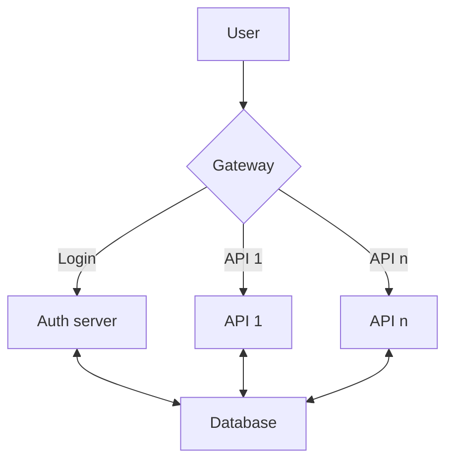

# bachelor-rest-api
A REST API microservice used in our bachelor.

### List of dockerhub repositories

| DockerHub repo                                                                           | Github repo  | Description                                                                                                                          |
|------------------------------------------------------------------------------------------|--------------| ------------------------------------------------------------------------------------------------------------------------------------ |
| [Gateway](https://hub.docker.com/repository/docker/danielneset/bachelor-gateway/general) | [Gateway]()  | This application is used to route the user to their correct endpoint, and handle authentication when it comes to accessing the API´s |
| [Auth](https://hub.docker.com/repository/docker/danielneset/bachelor-auth/general)       | [Auth]()     | This application is used to authenticate users and give them access to their API´s and the data they have access to                  |
| [REST API](https://hub.docker.com/repository/docker/danielneset/bachelor-rest-api/general)                                                                             | [REST API](https://github.com/ADNTNU/bachelor-rest-api) | This application is used to let the user communicate with our system thrue a rest api |

### FLow diagram

